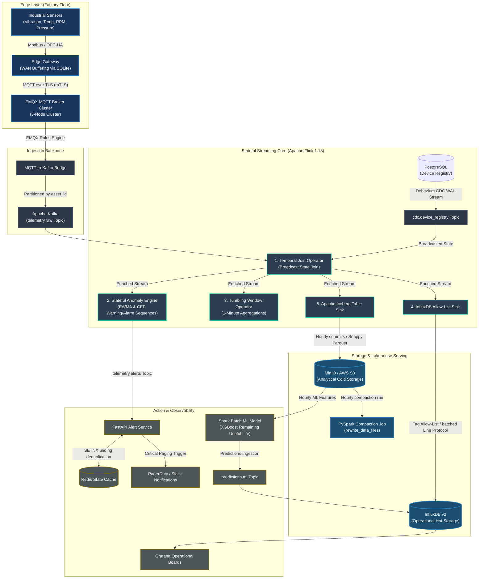

# IoT Sensor Streaming Platform (Production-Grade Stateful Telemetry Architecture)

A high-throughput, WAN-resilient stateful streaming platform designed to ingest telemetry from 100K+ factory floor IoT sensors at a peak rate of **~1M events/second**. The platform applies stateful stream processing with Apache Flink for real-time anomaly detection and predictive windowed aggregates, storing hot telemetry in InfluxDB for operational dashboards and committing cold Parquet files to an Apache Iceberg lakehouse on AWS S3/MinIO for batch ML training.

---

## 1. End-to-End System Blueprint



---

## 2. Advanced Technical Specifications & Solutions

### A. Watermark Safety Clamps for Clock Drift
Industrial sensors frequently suffer from hardware clock drifts or delayed network packet transmissions. In event-time stream processing, a single outlier timestamp can stall the entire pipeline's watermark or trigger massive data discards.
*   **The Safety Clamp**: Before assigning watermarks, Flink applies a safety mapping function that clamps incoming timestamps relative to the processing execution window:
    $$T_{\text{event}} = \text{clamp}(T_{\text{raw}}, T_{\text{ingest}} - 5\text{ min}, T_{\text{ingest}} + 5\text{ min})$$
*   **Keyed Watermarks**: Watermarks are extracted per-device using `WatermarkStrategy.forBoundedOutOfOrderness(Duration.ofSeconds(5))` applied on the keyed stream (`telemetry.keyBy(RawEvent::getAssetId)`). Late arrivals past this boundary are side-routed to a recovery Kafka topic `telemetry.late` for offline auditing.

### B. Dynamic Metadata Enrichment via Broadcast CDC Temporal Joins
Enriching telemetry streams with site locations and threshold parameters using traditional database queries stalls performance at high volumes.
*   **Broadcast State Design**: Postgres changes (INSERT/UPDATE/DELETE) on the device registry are captured by Debezium CDC and broadcasted to all parallel Flink operators using Flink's `BroadcastStream`:
    ```java
    MapStateDescriptor<String, DeviceRegistryRecord> desc = 
        new MapStateDescriptor<>("registryState", String.class, DeviceRegistryRecord.class);
    BroadcastStream<DeviceRegistryRecord> broadcastStream = registryStream.broadcast(desc);
    ```
*   The parallel telemetry processing operators map each incoming event against this local, memory-cached broadcast state using a `KeyedBroadcastProcessFunction`, running enrichments in sub-milliseconds with zero remote database network overhead.

### C. Stateful Anomaly Engines: CEP and EWMA Process Functions
*   **Flink CEP Sequences**: Detects physical correlation alerts (e.g., a machine RMS vibration threshold exceeded, immediately followed by a thermal spike within 30 seconds):
    ```java
    Pattern.<EnrichedEvent>begin("high_vibration").where(event -> event.getValue() > event.getVibrationThreshold())
        .followedBy("temp_spike").where(event -> event.getValue() > event.getTempThreshold())
        .within(Time.seconds(30));
    ```
*   **EWMA Process Function**: A custom stateful `KeyedProcessFunction` maintains rolling Exponentially Weighted Moving Averages (EWMA) and rolling variance using Flink's `ValueState`. It detects gradual degradation of machine bearings by triggering critical alerts when values deviate by more than **$3\sigma$** from the rolling average:
    $$S_t = \alpha X_t + (1 - \alpha) S_{t-1}$$
    $$\sigma_t^2 = (1-\beta)\sigma_{t-1}^2 + \beta(X_t - S_{t-1})^2$$

### D. InfluxDB Cardinality Governance Allow-list
Writing unique UUIDs or device tags into InfluxDB tags causes an **index cardinality explosion**, stalling RAM and breaking database performance.
*   The custom `InfluxDBLineProtocolSink` enforces a tag governance allow-list:
    ```java
    private static final Set<String> ALLOWED_TAGS = Set.of("site_id", "asset_id", "metric_name", "device_class");
    ```
    Any dynamic parameter outside this set is automatically moved to non-indexed **Fields**. Writes are batched in memory (1,000 points or 250ms timeouts) and processed over HTTP Line Protocol with async backpressure propagation.

### E. Iceberg Small File Compaction
Frequent streaming commits (every 60 seconds) produce hundreds of tiny Parquet files on S3.
*   **Compaction**: An hourly scheduled PySpark compaction job merges these fragments into optimal 512MB Parquet blocks while cleaning up orphaned metadata snapshots to maintain high query efficiency:
    ```sql
    CALL catalog.system.rewrite_data_files(table => 'db.telemetry_raw', options => map('max-file-size-bytes', '536870912'))
    ```

### F. FastAPI Alert Storm Deduplication via Redis SETNX Pipelines
A single machinery failure can trigger hundreds of secondary telemetry warnings, leading to "alert storms."
*   The FastAPI consumer listens to `alerts.raw` and deduplicates pages using a atomic Redis pipeline:
    ```python
    dedup_key = f"alert:{asset_id}:{rule_id}:dedup"
    is_new = await redis.set(dedup_key, "active", ex=300, nx=True)
    ```
    If `is_new` is true (Redis `SETNX` succeeded), the page is routed to PagerDuty. Otherwise, a secondary audit counter is incremented, blocking duplicate alert noise within a 5-minute sliding window.

---

## 3. Directory Layout

```text
├── .github/workflows/         # GitHub CI/CD build actions
├── edge/                      # IoT Simulator and WAN SQLite spooling queue
├── emqx/                      # EMQX configuration & MQTT-to-Kafka rule engines
├── postgres/                  # Postgres DDLs and logical replication replication setups
├── flink-jobs/                # Core Flink 1.18 stateful stream processing project
│   ├── pom.xml
│   └── src/main/java/com/iot/streaming/
│       ├── TelemetryPipeline.java    # Main event-time aggregate pipeline
│       ├── model/                    # Core DTO entities
│       ├── functions/                # Broadcast State Joins & EWMA Anomaly Processors
│       └── sinks/                    # Cardinality-controlled Influx and Iceberg sinks
├── alert-service/             # FastAPI alert storm suppressor microservice
├── ml-pipeline/               # PySpark compaction and XGBoost TTF model engines
├── terraform/                 # AWS infra setting up EKS, VPC, and MSK clusters
└── grafana/                   # Grafana time-series operational dashboards
```

---

## 4. Sandbox Setup & Run Guide

Provision the complete sandbox stack (EMQX, Kafka, InfluxDB, Postgres, Redis, Grafana, Flink) using Docker Compose:

### Step 1: Boot Infrastructure
```bash
docker-compose up -d --build
```

### Step 2: Compile Flink Stream Engine
Ensure Java 11 and Maven are installed locally:
```bash
cd flink-jobs
mvn clean compile package
```

### Step 3: Start the FastAPI Alert Storm Deduplicator
```bash
cd alert-service
pip install -r requirements.txt
uvicorn app:app --port 8000 --reload
```

### Step 4: Run the MQTT Edge Simulator
```bash
cd edge
pip install -r requirements.txt
python simulator.py
```

### Sandbox Dashboard Access
* **EMQX Console**: http://localhost:18083 (User: `admin` / Password: `public`)
* **InfluxDB UI**: http://localhost:8086 (User: `admin` / Password: `password1234`)
* **Grafana Operational Panels**: http://localhost:3000 (User: `admin` / Password: `admin`)
* **Flink Web Dashboard**: http://localhost:8081

---

## 5. Skills Mastered & Demonstrated
* **Stateful Stream Processing**: Apache Flink, CEP patterns, ValueState management, Watermark custom strategies.
* **Low-Latency Databases**: InfluxDB time-series optimization, cardinality allow-list governance.
* **Resilient Distributed Ingestion**: MQTT brokers (EMQX), Apache Kafka, edge-spool buffering.
* **Metadata Dynamic Streaming**: logical WAL CDC captured via Debezium, Flink Broadcast state joins.
* **Reliability Engineering**: Sliding-window Redis deduplication engines, backpressure async sinks.
* **Cloud & DevOps**: Terraform modules, Kubernetes nodes, Docker Compose sandboxing.
